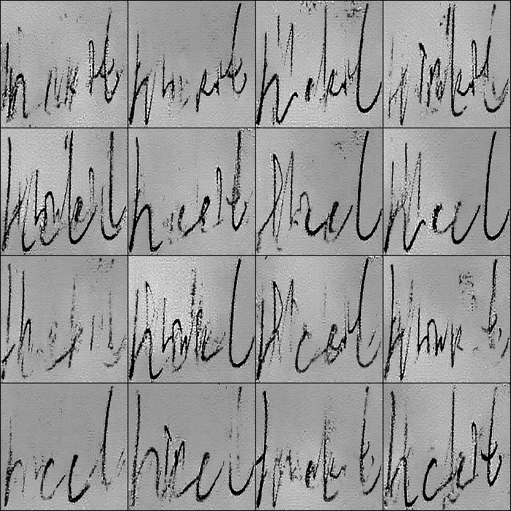

# 本项目主要用于为手写体文字训练生成GAN图像，为后续的手写体识别有效的增强数据
* 本项目GAN使用的是dcgan网络
* 在极其有限的手写体图像集当中，copy生成一批训练集，用于GAN网络discriminator的训练，`cd copydata && python3 copy.py`
* 返回至根目录，开始运行训练`cd .. && python3 dcgan.py`
* 训练完成后，运行`python3 generate.py`生成GAN图像
* 训练效果如下
    * 
    * 